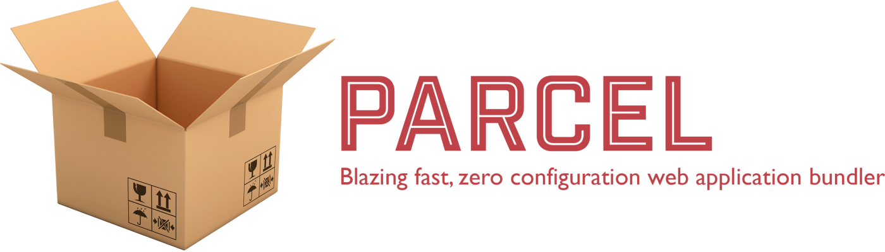
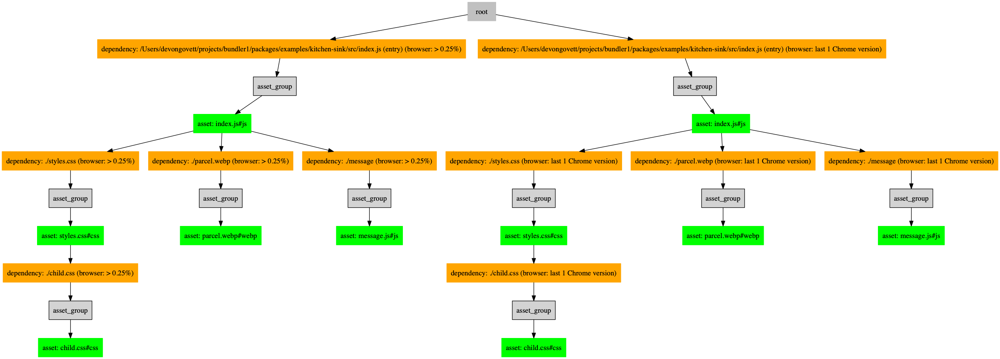

Today I’m incredibly excited to release the first alpha version of Parcel 2! Please try it out and help us take Parcel 2 to the finish line. Check it out on GitHub!

Parcel 2 is a ground up rewrite of Parcel that we’ve been working on for over a year, and designing for almost a year before that. It incorporates everything we’ve learned building Parcel since the beginning, and the result is more **extensible**, **scalable**, and **reliable** than Parcel 1, while retaining the ease of use and **developer experience** you’ve come to expect from Parcel.

- **🎛 Extensibility** — Parcel 2 is fully extensible, from end to end. The plugin types have been expanded to allow extending and overriding nearly all of the core behavior with easy to configure pipelines. While the default settings include everything in Parcel 1 (and more), now **you can customize and extend just about everything** if you need to.

- **⚖️ Scalability** — While Parcel has always utilized parallelism and caching to scale to large applications, this is taken even further in Parcel 2. We now **cache and parallelize even more** of Parcel’s work, so you can expect even faster builds, especially cached builds. We also keep much less in memory, so Parcel 2 can scale to even larger apps.

- **💪 Reliability** — Parcel 2 improves the reliability of our cache while at the same time improving performance to the max. We utilize a brand new cross platform filesystem [watcher](https://github.com/parcel-bundler/watcher), which can detect granular file changes even while Parcel is not running. At the same time, our asset graph can be invalidated super granularly, which means that **cached builds have almost exactly the same performance as watch mode!**

### Configuration

Parcel famously requires zero configuration. This never meant non-configurable, just that Parcel attempted to infer as much as possible from the code itself, and used existing config files for other tools (e.g. .babelrc). Users have loved the ease of use and developer experience that this has provided, but there are always edge cases and real use cases that require a bit more customizability.

Parcel 2 is **optionally configurable**. The default config built into the Parcel 2 CLI will be enough for the majority of apps and includes everything Parcel 1 supported and more, but Parcel 2 supports extending the core with additional functionality through a complete set of plugin types designed specifically for each of Parcel’s core stages.

- **🔎 Resolvers** — resolvers turn imports like import './foo' or import 'react' into full file paths like /my/project/foo.js. The default resolver in Parcel 2 includes support for the node resolution algorithm, plus some extras like aliases. But, if you want to extend or override the resolution algorithm for your project, now you can with a resolver plugin.

- **🦋 Transformers** — transformers compile code and other assets from one language to another, or just transform files in some way. For example, the TypeScript transformer compiles TypeScript to JavaScript, and the Babel transformer transpiles JavaScript to different JavaScript. Transformers are also responsible for extracting dependencies from code, such as import statements and require calls, which get passed back to the resolver, to another transformer, and so on until a full asset graph for the application is built.

- **🗃 Bundlers** — bundler plugins take an asset graph as input, and output a bundle graph which is like the asset graph but with the assets grouped into bundles. The default bundler groups assets with like file types like JavaScript and CSS together, and performs code splitting and some additional optimizations. I’m excited to see how the community will experiment with custom bundler plugins that take advanced code splitting even further!

- **🏷 Namers** — namer plugins are responsible for determining the output filenames for each bundle. The default namer plugin includes content hashing for long term cachability of assets, and the same naming rules as Parcel 1. If you need to customize the filenames of your bundles for any purpose, a namer plugin is the way to do it!

- **👟 Runtimes** — runtime plugins allow inserting code into bundles at build time. By default, we use this to add the runtime code needed to load bundles asynchronously, and insert the hot module replacement runtime for development, but you could use them to insert any kind of code you need conditionally at build time.

- **📦 Packagers** — packagers combine assets of a common type into an output bundle that can be loaded in a browser. For example, the JS packager combines JavaScript files together so that they are executed in the right order, at the right time.

- 🗜 **Optimizers** — optimizer plugins optimize a bundle in some way, for example minimizing or compressing files. For example, the [terser](https://github.com/terser-js/terser) optimizer minimizes JavaScript bundles.

- **✅ Validators** — validator plugins run in the background to perform code validation, such as linting (e.g. eslint) or type checking (e.g. TypeScript). They don’t block development builds, but when enabled, will block production builds from succeeding. Since they run in the background on a low priority queue, they don’t cause any performance degradation when you just want to make changes quickly.

- **🗞 Reporters** — reporter plugins receive events throughout the bundling process with status information and logging events. For example, the Parcel 2 CLI is implemented with a reporter, as is the dev server. You could also use reporters to implement other types of UIs or dashboards, bundle visualizers, etc.

All of these are configured in a very simple JSON file called .parcelrc. There is no JavaScript or complex logic required to configure Parcel, if you ever need to at all. You can also extend other configs, and share them as npm packages. We expect that most configs will extend the @parcel/config-default package to add or override some of the built-in defaults as needed.

For example, here’s how you’d add a transform for [Dart](https://dart.dev) to your app once you’ve published the parcel-transform-dart package.

    {
      "extends": ["[@parcel/config-default](http://twitter.com/parcel/config-default)"],
      "transforms": {
        "*.dart": ["parcel-transform-dart"],
      }
    }

### Small Core

Now that everything in Parcel is split out into plugins, Parcel core is incredibly small. It now essentially just runs other tools as needed based on a graph of the files in your application, in a very intentional and optimized way. Everything is designed to be done in parallel and be cacheable, both locally and eventually, across machines.

Parcel maintains a highly optimized graph of your entire application, which can be invalidated super granularly to trigger rebuilds of only exactly what is needed when things change. This includes both your code, and everything that influences how that code is built, such as config files (e.g. .babelrc), plugin versions, and more. The whole graph is cached on disk when Parcel stops, and can be restored on startup and invalidated granularly so that only files that changed are rebuilt. It’s just like watch mode, but even when Parcel is restarted!

_A Parcel asset graph, showing a build with multiple targets (see below)._

The worker farm has been updated to make use of the new [worker_threads](https://nodejs.org/api/worker_threads.html) module built into Node 12 when available, which has lower overhead than the multi-process backend used in previous versions. Additionally, we’ve abstracted all filesystem access in Parcel so that it is pluggable with different filesystem implementations. For example, you might want to use an in memory filesystem to run Parcel in the browser.

### Multiple targets, and bundle splitting

Aside from a completely new core and plugin system, Parcel 2 also has a bunch of new features, including support for **multiple targets**, and **bundle splitting**.

Parcel 2 allows you to configure builds for **multiple targets**, which will be built in parallel. For example, you may want to build a version of your application for modern browsers with modern syntax, and one for legacy browsers with more transpilation. Or maybe you want to build a library for both node and the browser. Now you can do that and more, by configuring targets in your package.json.

The following example will result in two complete builds, compiled for a recent Chrome version, and more legacy browsers. These can then be loaded with differential loading techniques to decrease bundle sizes for modern browsers.

    {
      "browser": "dist/legacy/index.js",
      "browserModern": "dist/modern/index.js",
      "targets": {
        "browserModern": {
          "engines": {
            "browsers": [
              "last 1 Chrome version"
            ]
          }
        },
        "browser": {
          "engines": {
            "browsers": [
              "> 0.25%"
            ]
          }
        }
      }
    }

In local development, we avoid this extra work by compiling for a default modern browser target, for performance. This means that Babel and other tools need to do less work to transpile your code, when you’re just testing in Chrome. If you need to test a specific target (e.g. an old browser like IE 11), you can choose to build for that target with the --target option to the CLI.

Parcel 2 also supports advanced **bundle optimizations**, which automatically split out common dependencies like react and other libraries into their own bundles that can be loaded in parallel and cached separately from the rest of your code. This should result in smaller initial bundle sizes than Parcel 1, because it no longer hoists common dependencies to the top of the tree when they aren’t needed by the entry bundle.

### Whole application bundling

From the beginning, Parcel went farther than many other tools in bundling your whole application, including JavaScript, CSS, HTML, and static assets. Most other bundlers are still very JavaScript focused, and convert all asset types to JS, possibly with additional plugins to extract them again later. Parcel is file type agnostic, and Parcel 2 takes this even further by allowing you to override and compose every aspect how your code is processed.

Parcel 2 plugins are organized into pipelines, which can be composed very easily to specify advanced transformations and build steps. Assets match an initial pipeline by a glob, and run through all of the plugins in that pipeline until the file type changes (e.g. .ts → .js). Then, they continue through the next pipeline, and so on until the end of a pipeline is reached. This allows individual plugins to focus on a single task, and lets the user compose multiple plugins together to do something more complex.

Transformations can also output multiple assets, in case there are inline assets of a different type, such as an inline `<script>` or `<style>` tag in an HTML file, a multi-part Vue SFC, or other types of multi-part files yet to be invented. These inline assets will be processed the same way separate files would, and can be re-inserted back into the file they came from after they are processed by their respective pipelines.

This kind of flexibility and composability has never been possible before in a JavaScript bundler, and I’m super excited to see what types of new tools built on top of Parcel this enables!

### The Team

Parcel 2 would not have happened without the amazing core team that has been working tirelessly to build it!

- [Will Binns-Smith](https://twitter.com/wbinnssmith)

- [Jasper De Moor](https://twitter.com/JasperDeMoor)

- [Devon Govett](https://twitter.com/devongovett)

- [Jamie Kyle](http://jamie.build)

- [Niklas Mischkulnig](https://twitter.com/mischnic)

- [Maia Teegarden](https://twitter.com/padmaia)

- [Kyle Welch](https://twitter.com/kylewelch)

Thanks to [Atlassian](https://www.atlassian.com) for investing so much into Parcel, and sponsoring two of the devs listed above full time (Maia and Will). And many thanks to everyone who has donated to our [Open Collective](https://opencollective.com/parcel) as well — it really helps make Parcel possible. 😍

### Try it out and help us get to the finish line!

You can install Parcel 2 with yarn add parcel@v2 to try it out. A [getting started guide](https://github.com/parcel-bundler/parcel/tree/v2#getting-started) is available in the readme. The CLI is mostly compatible with Parcel 1, but there are some differences you may come across in this early version. Also note that any Parcel 1 plugins you were using will no longer work in Parcel 2, and will need to be ported.

This is the first alpha of Parcel 2, and as it is alpha, there will be bugs and missing features. In particular, many of the plugins haven’t been ported from Parcel 1 to Parcel 2 yet. If you’d like to help, please feel free to check out the existing plugins on the [v2 branch](https://github.com/parcel-bundler/parcel/tree/v2/packages) for inspiration (we’ll have full docs by Parcel 2’s final release), and the [Parcel 2 label](https://github.com/parcel-bundler/parcel/issues?q=is%3Aissue+is%3Aopen+label%3A%22✨+Parcel+2%22) on GitHub. Some of the issues there are labeled with “Good First Issue” as well, and would be a good place to start.

Please [report any bugs](https://github.com/parcel-bundler/parcel/issues) you find on GitHub. You can also find me [@devongovett](https://twitter.com/devongovett) on Twitter.

- [GitHub](https://github.com/parcel-bundler/parcel)

- [Spectrum Community](https://spectrum.chat/parcel)

- [Support us on Open Collective](https://opencollective.com/parcel)
