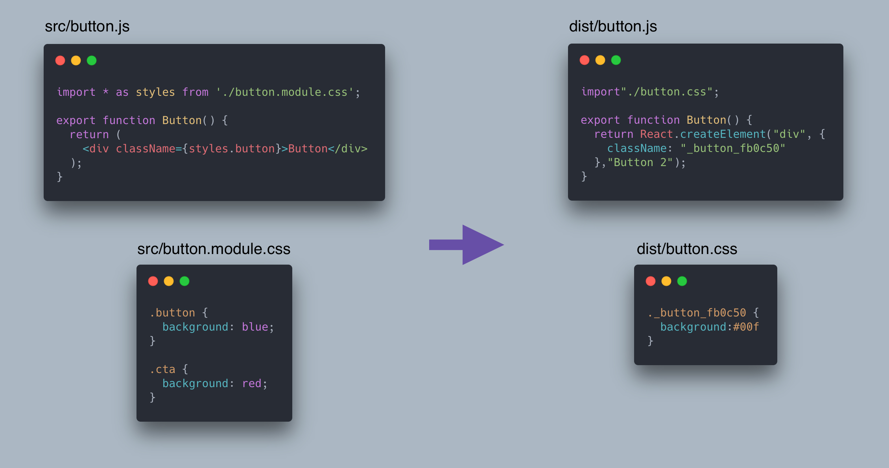

The Parcel team is excited to release Parcel 2 beta 3! **This release includes a ground up rewrite of our JavaScript compiler in Rust, which improves overall build performance by up to 10x.** In addition, this post will cover some other improvements we’ve made to Parcel since our last update, along with our roadmap to a stable Parcel 2 release.

## 10x faster JavaScript compiler written in Rust 🚀

Over the past few months, we’ve been working on rewriting our JavaScript compiler in Rust! Parcel's JavaScript compiler is responsible for detecting dependencies in your code (like `import` statements and `new Worker()` calls), inlining `process.env` variables and other Node globals, and performing scope hoisting.

In addition, Parcel automatically transpiles your source code for your configured `browserslist` targets, along with non-standard syntax like JSX and TypeScript, and development features like React Fast Refresh.

Previously, all of this was implemented in JavaScript on top of a Babel AST. While we had [made](https://github.com/parcel-bundler/parcel/pull/4366) [great](https://github.com/parcel-bundler/parcel/pull/4815) [progress](https://github.com/parcel-bundler/parcel/pull/5432) optimizing this, JavaScript compilation was still by far the slowest part of Parcel. In particular, serializing large JavaScript ASTs to send between threads was very slow, and these large objects put a lot of pressure on the JavaScript garbage collector. Also, JavaScript code must be compiled by the engine every time it is run, which means it is slow to start up. While improving algorithmic complexity will result in performance improvements regardless of the language, that can only take you so far.

Parcel's new JavaScript transformer is written in Rust on top of the [SWC](https://swc.rs) compiler. SWC provides JavaScript parsing and code generation, along with a solid foundation for building super fast AST transformations. Rust provides predictable performance, instant startup times, and the ability to optimize down to the hardware level.

In addition, the scope hoisting linker now operates only on strings rather than ASTs, which also massively improves performance because we avoid serializing and deserializing these large objects. This also allows code generation to be parallelized across all files rather than performed on the whole bundle at once.

**Overall, this improves build performance by up to 10x!**

On the ESBuild benchmark, Parcel is now ~10x faster without Terser, and ~3x faster when minification is enabled.

### Transpilation performance

In addition, SWC replaces Babel by default for transpilation when a `browserslist` is set, as well as for compiling JSX and TypeScript, and React Fast Refresh. **SWC is 20x faster** than Babel, so this change should also improve overall performance significantly.

While SWC is the default, rest assured that **Babel is still supported** as well. If you have a custom Babel configuration in your project, it will still be used automatically. This means that custom Babel plugins (e.g. CSS-in-JS transforms, Babel macros, etc.) continue to work out of the box. Scope hoisting, dependency collection, and everything else that was built into Parcel before will now occur in Rust, but this should be completely transparent.

This does open up the possibility to improve the performance of your build even further, however. You can now remove `@babel/preset-env`, `@babel/preset-react`, and `@babel/preset-typescript` from your `.babelrc` and they will be automatically handled by SWC instead. This can significantly improve your build performance. If you have additional custom Babel plugins, you can leave them in your Babel config. If not, you can delete your Babel config entirely. We will likely add a warning in the future to assist with this migration.

### Scope hoisting improvements

Aside from performance, we ran into some issues with our old scope hoisting implementation that motivated a rewrite. In particular, several JavaScript bundlers including Parcel have [bugs](https://github.com/parcel-bundler/parcel/issues/5659) related to execution ordering when scope hoisting and code splitting are used together.

Scope hoisting is the process of combining multiple JavaScript modules together into a single scope. This enables dead code elimination (aka tree shaking) to be more effective, and improves runtime performance by making cross-module references static rather than dynamic property lookups.

When hoisting multiple modules together into the same scope rather than wrapping each module in a separate function, it becomes difficult to ensure that these modules always execute in the correct order when they are referenced across bundles.

In addition, sometimes small modules are duplicated between multiple bundles in order to avoid producing many very tiny output files and increasing the number of HTTP requests needed to load a page. Previously, this could result in a module executing more than once, which could break many things, including side effects (e.g. mutating the DOM) and singleton patterns.

In order to fix these problems, it was necessary to rethink how our scope hoisting compiler worked from the ground up. The result is a hybrid between scope hoisting where we can, but falling back wrapping modules in a CJS-style function with a global module registry where needed. This ensures that modules that are referenced between bundles execute in the correct order, and that duplicated modules only execute once.

If you’re curious to read more about how our scope hoisting implementation works, check out the [design document](https://github.com/parcel-bundler/parcel/blob/v2/packages/transformers/js/hoist.md), which goes into detail on all of these topics.

## Tree shaking dynamic import

Another feature related to our scope hoisting implementation is support for tree shaking dynamic `import()`. Parcel can detect which properties of a dynamic import are accessed, and exclude the exports from the resolved module that aren't used. This works with promise chaining, async/await, destructuring, and static object property accesses. If anything is accessed non-statically, e.g. a computed property, then all of the exports will be included.

## Tree shaking CSS modules

We also now have support for tree shaking CSS modules. When you import a CSS module in JavaScript, Parcel tracks which classes are used, and automatically excludes the unused selectors from the compiled CSS file. In addition, class names are now automatically inlined in the compiled JavaScript rather than stored in a large object map. This should help reduce the bundle size of both CSS and JS output!

## Lazy development builds

In development, it can be frustrating to wait for your entire app to build before the dev server starts up. This is especially true when working on large apps with many pages. If you’re only working on one feature, why do you need to wait for all of the others to build unless you actually navigate to them?

Parcel now supports a `--lazy` CLI flag when using the dev server. When enabled, Parcel only builds files that are requested on demand, which can significantly reduce development build times. The server starts instantly, and when you navigate to a page for the first time, Parcel builds only the files necessary for that page. When you navigate to another page, that page will be built on demand.  If you navigate back to a page that was previously built, it loads instantly.

<video src="lazy.mp4" playsinline loop autoplay muted></video>

This also works with dynamic `import()`, not just completely separate pages. So if you have a page with a dynamically loaded feature, that feature will not be built until it is activated. Parcel is smart enough to eagerly build all of the dependencies of the requested file at once, without waiting for them to be requested as well. If you have some CSS that goes along with your JavaScript, or some referenced images, they'll all be built together – no network waterfall!

The tradeoff, of course, is that page loads and dynamic imports can be slightly slower the first time they are loaded. But with Parcel's disk caching, that should only ever happen once. Even when you restart Parcel, there should be no need to rebuild files that didn't change.

## Cache reliability

Speaking of caching, another area that we’ve been working on is cache reliability. We want users to trust the cache, so we need to ensure that everything that could possibly invalidate the cache actually does invalidate the cache. This is much harder than it sounds. Modern JavaScript build tools have a lot of inputs to keep track of – files on disk, configuration, environment variables, the dev dependencies that were used to compile your code, and much more. When any of these change, Parcel needs to invalidate the cache and re-compute the output.

Parcel tracks all of these inputs in a graph. [Our file watcher](https://github.com/parcel-bundler/watcher) watches for changes on disk, and invalidates any requests that are connected to the files that changed. This also occurs when you restart Parcel. Our watcher integrates with operating system level APIs to quickly determine what files changed since you last ran Parcel, which means that restarting Parcel is almost as fast as using watch mode!

## Dev dependency HMR

A side benefit of all of this work on cache invalidation is that watch mode also benefits. One cool feature that we’ve implemented is **HMR for Parcel plugins** and other build dependencies. When you make a change to a plugin's source code, we reload the plugin in place and rebuild any files that it had previously compiled. This makes it super fast to work on a plugin and see your changes instantly – no need to restart Parcel.

<video src="plugin-hmr.mp4" playsinline loop autoplay muted></video>

It also works with Babel plugins, PostCSS plugins, and any other dev dependency involved in your build. You can even edit plugins in `node_modules` and Parcel will recompile automatically. This is useful when you need to debug something in your build pipeline, or make use of tools like [patch-package](https://github.com/ds300/patch-package).

## Fewer dependencies

Parcel supports many different languages and tools out of the box, which makes it really easy to get started. But one downside of this is that installing Parcel includes many dependencies that you might not use. This not only uses up disk space and network bandwidth, but is also more dependencies for you to maintain and audit.

We wanted to reduce Parcel's dependencies while still keeping things really simple to use. To do this, we now only install essential plugins by default, and auto install additional plugins into your project on demand.

<video src="autoinstall.mp4" playsinline loop autoplay muted></video>

By default, we include support for standard web languages like HTML, CSS, and JavaScript. But as soon as you include a SASS file, Vue, Elm, CoffeeScript, or any other file type that Parcel recognizes, we’ll automatically install the necessary plugins and all peer dependencies into your project. This keeps Parcel super easy to use (zero config) but also reduces the number of dependencies in your project.

## Roadmap

Parcel 2 has been in development for a couple years now, and we haven’t always done the best job of updating the community on where things stand on our roadmap to a stable release. So, this section is an update on our progress.

Beta 3 will most likely be the final beta before our first release candidate, which we're hoping will be out in about a month. For the first rc, we are working on the following items:

- Improved cache invalidation for packaging and optimizing
- Ensuring the cache is portable between machines or different file paths (e.g. in CI)
- Improved automatic differential bundling support (module/nomodule)
- API consistency

After rc, the public API will be frozen, and we’ll focus on bug fixes and documentation. This will hopefully take around a month. Once ready, we’ll release 2.0!

At this point, it is very likely that the plugin APIs for bundlers, runtimes, and validators will be marked as experimental in Parcel 2.0. This means these features will not follow semver and we will continue iterating on them after the initial stable Parcel 2 release. In addition, we have many other features and improvements planned for post-2.0, including further performance optimizations.

## Thanks!

As always, thanks for trying out our betas and giving us feedback on [GitHub](https://github.com/parcel-bundler/parcel/issues). You can also donate to our [open collective](https://opencollective.com/parcel), which helps support our contributors.
