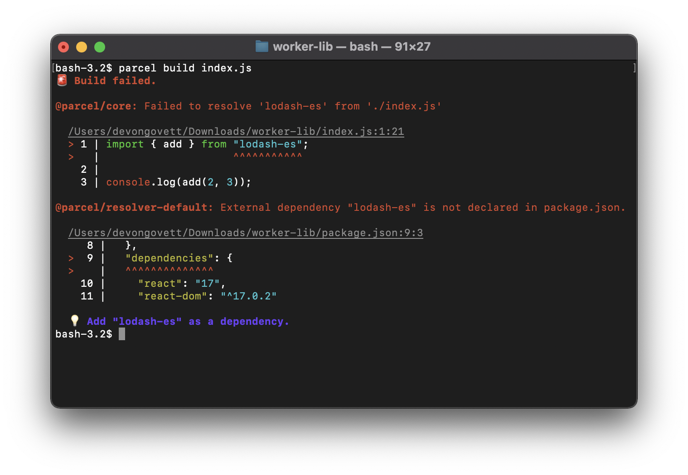

The Parcel team is very excited to announce the first Parcel 2 release candidate! This release includes many improvements, including new features, better performance, API consistency, and lots of bug fixes and stability improvements.

## Automatic differential bundling via native ES modules

Parcel 2 now automatically generates both native ES modules for modern browsers and fallback classic scripts for old browsers. This reduces bundle sizes significantly for a majority of users by shipping modern syntax rather than transpiling to ES5.

### Classic scripts vs. ES modules

One of Parcel’s fundamental design goals has always been to work like the web does. We try to avoid lock in by following web standards and not inventing Parcel-specific syntax or features as much as possible. One place where this was not true in Parcel v1 was the way Parcel handled `<script>` tags in HTML. Previously, Parcel would treat all scripts as modules, including support for `import` and `export` statements, and isolating each file's top-level scope from other modules. While convenient, this is not actually how the `<script>` tag works in the browser.

Classic scripts, without `type="module"`, actually treat variables in the top-level scope as globals, and cannot have imports or exports, so now Parcel matches this behavior as well. This also fixes some issues with legacy libraries like jQuery that expect to be running in a global script environment and not in an isolated module.

When you upgrade from a previous version of Parcel, you’ll need to add the `type="module"` attribute to your script tags. You'll see a diagnostic like the one below pointing you to the locations you need to modify.


### Differential bundling

Differential bundling is the idea of shipping multiple versions of your code for different targets, and allowing the browser to choose the most optimal one to download. Modern browsers support `<script type="module">`, which in addition to supporting import and export syntax, also supports other modern syntax such as classes, arrow functions, async/await, and more. Shipping modern syntax rather than transpiling this syntax to older JavaScript versions, [can dramatically reduce](https://web.dev/publish-modern-javascript/) bundle sizes and improve load times. However, if you still need to support older browsers, `<script nomodule>` can be used to send a transpiled version of your code that will only be loaded in older browsers. This gives you the best of both worlds – smaller bundles for a majority of users, but without sacrificing users on older browsers.

Differential bundling using the module/nomodule pattern is now completely automated in Parcel 2. Just use a `<script type="module">` tag in your HTML file, pointing to your source code, and Parcel will automatically generate a `nomodule` version as well if needed.

```html
<script type="module" src="app.js"></script>
```

becomes:

```html
<script type="module" src="app.c9a6fe.js"></script>
<script nomodule src="app.f7d631.js"></script>
```

This happens automatically based on your browser targets, as declared in the `"browserslist"` key in your package.json file. If some of your targets don't support ES modules natively, a `nomodule` version will be compiled automatically.

## Improved JSX support

Parcel has always supported JSX out of the box, and even automatically detects which library you're using (e.g. React, Preact, etc.) and compiles accordingly. New in this release, Parcel now supports the [new JSX runtime](https://reactjs.org/blog/2020/09/22/introducing-the-new-jsx-transform.html) added in React 17. This is completely automatic – Parcel detects the version of React used by your code and chooses the correct JSX runtime accordingly. The new JSX runtime should result in smaller bundles, and performance improvements. You also no longer need to import React manually in every file in order to use JSX. Please read the [blog post](https://reactjs.org/blog/2020/09/22/introducing-the-new-jsx-transform.html) from the React team for more information.

In addition, Parcel will now read the `tsconfig.json` or `jsconfig.json` file in your project, which allows you to configure several aspects of JSX compilation. You can use this to override the JSX runtime, library, and other properties, as well as enable other experimental JavaScript features like decorators. Please see the [TSConfig reference](https://www.typescriptlang.org/tsconfig) from the TypeScript team for more information.

## Improved worker support

Parcel has supported web workers and service workers for a long time, and in this release we’ve made some major improvements. Similar to `<script>` tags in HTML, there are actually two kinds of workers supported in browsers: classic script workers, and ES module workers. Parcel has historically considered all workers to be modules, but in this release, we now match native browser behavior and treat these differently.

To create a worker that uses ES module syntax such as `import` and `export`, the `type: 'module'` option is now required when constructing the worker. In addition, the `URL` constructor is now required to create a worker rather than passing a string literal. These changes improve Parcel's compatibility with both native browser behavior as well as other tools in the ecosystem.

```js
new Worker(
  new URL('worker.js', import.meta.url),
  {type: 'module'}
);
```

In addition, in module workers, `importScripts` is no longer supported, and should be replaced by an `import` statement or dynamic `import()`.

Parcel will display diagnostics to help you migrate existing code to the new patterns.


### Worklet support

In addition to web workers and service workers, Parcel also now supports worklets, including [CSS Houdini paint worklets](https://developers.google.com/web/updates/2018/01/paintapi) as well as [web audio worklets](https://developer.mozilla.org/en-US/docs/Web/API/Web_Audio_API/Using_AudioWorklet).

Paint worklets are detected automatically using the following syntax:

```js
CSS.paintWorklet.addModule(new URL('worklet.js', import.meta.url));
```

Web audio worklets are not statically analyzable, so for these you can use the `worklet:` named pipeline to get a URL to the worklet file compiled for the correct environment.

```js
import workletUrl from 'worklet:./worklet.js';

context.audioWorklet.addModule(workletUrl);
```

## Improved library builds

In this release, Parcel’s support for building libraries has been improved.

Parcel now supports the `.mjs` and `.cjs` file extensions used by Node.js to indicate whether a module is ESM or CommonJS. In addition, the `"type": "module"` field in package.json is supported. These hints help Parcel automatically determine which output format to use when compiling your source code. You'll also get a diagnostic if you try to use an unsupported file extension in package.json fields.


In addition, when you use workers or URL dependencies in your code, Parcel will now produce statically analyzable output when building a library. This enables your library to be bundled by Parcel or another bundler later when used in an app. URL dependencies compile to the `URL` constructor, which is supported both natively in Node and the browser as well as by many bundlers.

```js
new URL('some-code.js', import.meta.url)
```

Finally, we have improved our diagnostics for many cases related to libraries. For example, you’ll get a diagnostic when scope hoisting is disabled for library builds, or an unsupported output format is used. Another useful diagnostic we added lets you know when you have an external dependency in your code that is not declared in your package.json. This helps prevent shipping code that will break when your library is used by a downstream consumer.



## Miscellaneous JavaScript improvements

### Multiple dependency types in the same file

Previously, it was impossible to use multiple types of dependencies on the same specifier within a single file. For example, a file could not have both a static import and a dynamic import with the same specifier. This is now supported correctly.

```js
import something from './foo';

import('./foo');
```

### Destructuring process.env

Using destructuring syntax on process.env is now possible.

```js
let {NODE_ENV, API_TOKEN} = process.env;
```

### Support for standalone import.meta

Parcel now supports `import.meta` more fully. When referencing `import.meta` by itself, you'll now get an object containing a `url` property. `import.meta.url` compiles directly to the same URL, without the intermediary object. The URL is a `file://` URL containing a relative path from your project root to the file containing the `import.meta.url` reference.

```js
console.log(import.meta);
// => {url: 'file:///src/App.js'}

console.log(import.meta.url);
// => 'file:///src/App.js'
```

In addition, `import.meta.url` can be used as a self-reference when constructing a worker in cases where you want the file that starts the worker to also be the worker itself.

```js
new Worker(import.meta.url, {type: 'module'});
```

## Glob resolver plugin

Parcel 2 now has a glob resolver plugin that works similarly to the glob importing support in Parcel 1. This allows you to import multiple files at a time, and get back an object with keys corresponding to the files.

```js
import * as files from './files/*.js';

console.log(files.foo);
```

Is equivalent to:

```js
import * as foo from './files/foo.js';
import * as bar from './files/bar.js';

let files = {
  foo,
  bar
};
```

This also works with pipelines like `url:`, as well as with dynamic import.

```js
let files = import('./files/*.js');

async function doSomething() {
  let foo = await files.foo();
  let bar = await files.bar();
  return foo + bar;
}
```

Since glob imports are non-standard, they are not included in the default Parcel config. To enable them, add `@parcel/resolver-glob` to your `.parcelrc`.

```json
{
  "extends": "@parcel/config-default",
  "resolvers": ["@parcel/resolver-glob", "..."]
}
```

## Performance improvements

In our last release, we [announced](/blog/beta3/) our new JavaScript compiler written in Rust that improves performance by up to 10x. This release continues our work on improving performance, and is overall **~38% faster** than the previous beta. There have been many small changes that add up, but some of the highlights are described below.

### LMDB

Parcel caches everything it does on the file system. This improves performance when restarting Parcel by avoiding duplicate work. In addition, the file system is used during builds as a temporary storage area to communicate between worker threads. This also enables Parcel builds to be scalable to very large projects that exceed the amount of available memory. As such, the performance of writing and reading from the file system is very important to the overall performance of Parcel builds.

In this release, we’ve replaced the file system caching implementation with a store backed by [LMDB](https://symas.com/lmdb/). LMDB is an extremely fast embedded key-value store written in C. In particular, we're using the excellent [lmdb-store](https://github.com/DoctorEvidence/lmdb-store) module for Node. It uses a single memory-mapped file, and automatically handles writes in an asynchronous background thread.

**Using LMDB rather than the file system for our cache improves performance by ~20%!**

### xxHash

Parcel relies heavily on hashing for many things, including cache keys, content hashes, etc. We’ve relied on the builtin Node md5 function for most of our hashing previously, but in this release we’ve replaced this with [xxHash](http://cyan4973.github.io/xxHash/). xxHash is an extremely fast hash function, operating at RAM speed limits. We built a custom Node wrapper around a Rust implementation of xxHash which is ~7x faster than md5. Overall, this improves Parcel build performance by ~5%.

### Source maps improvements

Parcel uses [our own library](https://github.com/parcel-bundler/source-map), written in Rust, to manipulate source maps. Serializing and deserializing large source maps from the cache can take a significant amount of time. In this release, we replaced [Serde](https://serde.rs) and [Bincode](https://github.com/bincode-org/bincode) with [rkyv](https://github.com/rkyv/rkyv), an extremely fast zero copy deserialization framework for Rust. This is ~2.5x faster at reading a cached source map, which equates to ~5% faster overall Parcel builds.

## Caching improvements

Reliable caching has been a big area of focus in Parcel 2, as described in our previous blog posts. In this release, we’ve continued this work and completed the migration of all parts of Parcel 2 to our request-based caching architecture.

In particular, packaging and optimizing bundles was the last remaining phase of Parcel that was not fully reliable. We now properly invalidate the cache when configuration for packager and optimizer plugins change. In addition, only the bundles which have actually changed will be re-packaged and written to disk, which improves performance. If the dist directory is deleted or bundles are modified manually, Parcel will detect this and copy the previously packaged bundle from the cache back to the dist dir automatically.

Finally, the cache is now resilient to location and platform changes. For example, if your project is moved to a different location on the file system, or cloned on a different machine, the cache can now be reused. All referenced file paths are now stored relative to the project root rather than as absolute paths. They are also stored with platform-agnostic separators, which means caches can be shared between POSIX and Windows machines.

## API changes

In this release, we’ve made significant changes to our plugin API. If you have any existing plugins, you’ll likely need to update them. Since this is a release candidate, we’re committed to avoiding breaking API changes after this release.

The changes are mostly about improving consistency, readability, type safety, and understandability of the API. For example, the `loadConfig` API that is supported by all of our plugin types is now fully typed. In addition, the Asset and Bundle APIs have reduced their reliance on boolean flags and have replaced these with a smaller set of enumerations which indicate which options are actually mutually exclusive. There have been many changes, so please check out the API diff [here](https://github.com/parcel-bundler/parcel/compare/v2.0.0-beta.3.1...v2.0.0-rc.0#diff-8e7d238bb30ff1dc759768c799d9cd63024b9297af540bc3d2b10cddb9e159c9).

Finally, we now publish TypeScript definitions along with all of our public packages. This includes the plugin API as well as the programatic API for Parcel core. This should help both when writing plugins in TypeScript, as well as when using plain JavaScript in an editor like VSCode.

## Miscellaneous

This release includes a lot of other small improvements and bug fixes. A few highlights are below. See the [commit diff](https://github.com/parcel-bundler/parcel/compare/v2.0.0-beta.3.1...v2.0.0-rc.0) for a full list of changes, or the list of bugs fixed in the GitHub [milestone](https://github.com/parcel-bundler/parcel/milestone/9?closed=1).

### SVG optimizer

Parcel now includes an SVG optimizer plugin based on [SVGO](https://github.com/svg/svgo). This automatically reduces the file sizes of standalone `.svg` files referenced in your build. It can be configured with an `svgo.config.json` or `svgo.config.js` file.

In addition, SVGO is also used for embedded SVG inside HTML files. There have been several bug fixes related to that in this release as well.

### Image references

Parcel 2 no longer requires the `url:` prefix when referencing image files. These can be imported in JavaScript or referenced from HTML or CSS, and will result in a transformed URL that includes a content hash for long term caching.

Parcel also includes an image transformer, which you can enable by using a query parameter. This allows you to resize or convert images from a source file automatically. For example, in HTML you could reference the same image multiple times with different query params to generate multiple different representations in different formats.

```html
<picture>
  <source src="snow.jpg?as=webp&width=400" type="image/webp" />
  <source src="snow.jpg?as=jpg&width=400" type="image/jpeg" />
  
</picture>
```

### Web manifests

Parcel supports [web manifest](https://developer.mozilla.org/en-US/docs/Web/Manifest) files, which enable PWAs to be installed on the user's device. These are referenced from an HTML file using a `<link rel=“manifest”>` tag. Parcel automatically handles URL references in these files just like any other dependency. In this release, you can now use a `.json` file rather than a `.webmanifest` file, which many developers find preferable.

## Try it out!

Please try out the release candidate and give us feedback on [GitHub](https://github.com/parcel-bundler/parcel/issues). We will be fixing bugs, and improving the documentation over the next month or so before our stable release. You can also donate to our [open collective](https://opencollective.com/parcel), which helps support our contributors. Thanks!
