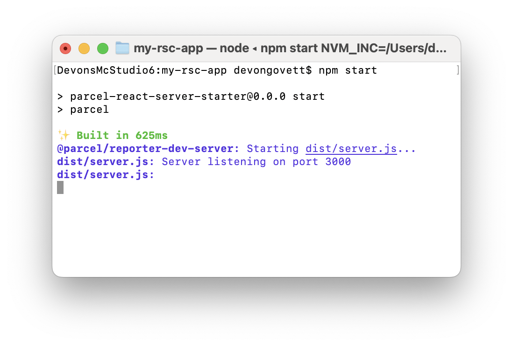
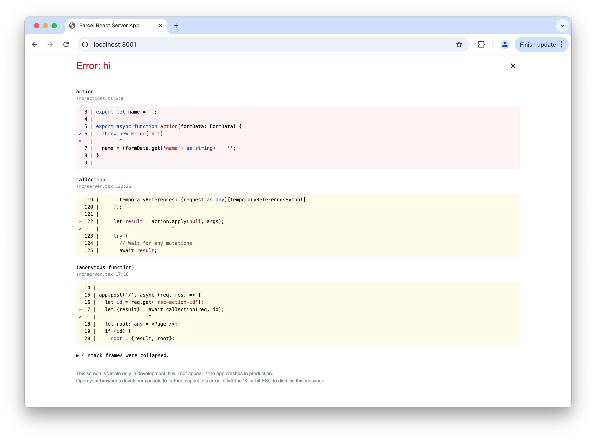

Parcel v2.14.0 introduces beta support for React Server Components, which can be integrated into existing client-rendered apps, server rendered at request time, or statically rendered to HTML at build time. In addition, it adds first-class MDX support, a CLI to scaffold new Parcel apps, and a new React error overlay. It also optimizes browser caching with native HTML import maps. This is a big release, so let's dive in!

## React Server Components

> UPDATE
>
> On 2025/12/03 a critical vulnerability was uncovered in React Server Components. https://react.dev/blog/2025/12/03/critical-security-vulnerability-in-react-server-components
>
> Ensure you're up to date with the latest fixes, especially [react-server-dom-parcel](https://vercel.com/changelog/cve-2025-55182#impact)

Parcel v2.14.0 introduces beta support for [React Server Components](/recipes/rsc/), a new type of component that renders ahead of time, on the server or at build time. Server Components seamlessly integrate client and server code in one unified component tree, helping reduce client bundle sizes by pre-rendering non-interactive components.

Unlike other RSC implementations, Parcel is not a full framework. Instead, it provides the tools you need to build your own application or framework from scratch with much less work. This gives you freedom to experiment with new patterns, or integrate Server Components into an existing app without a major rewrite.

Thanks to its existing multi-environment support, Parcel integrates server and client code in one unified module graph, building your entire app in a single command and supporting features like code splitting across environments. This includes support for the ["use client"](https://react.dev/reference/rsc/use-client) and ["use server"](https://react.dev/reference/rsc/use-server) directives to declare environment boundaries, dynamic import to load components on demand based on data, and more.

Check out our [rsc-examples](https://github.com/parcel-bundler/rsc-examples) repo for complete example apps built with React Server Components and Parcel, and see [the documentation](/recipes/rsc/) for a deep dive.

### Integrating into a client-rendered app

Parcel enables incremental adoption of Server Components within existing client-rendered React apps. For example, instead of returning JSON from an API server for a new feature, you could render Server Components. This can help reduce client bundle sizes by sending only the components needed to render the requested data, and omitting heavy non-interactive components (e.g. Markdown renderers) from the client bundle entirely.

```jsx
import express from 'express';
import {renderRSC} from '@parcel/rsc/node';

let app = express();
app.get('/comments', (req, res) => {
  renderRSC(<Comments />).pipe(res);
});

async function Comments() {
  // Load data from a database...
  let comments = await db.getComments();

  // Render Markdown and interactive Client Components
  return comments.map(comment => (
    <article key={comment.id}>
      <p>Posted by: {comment.user}</p>
      <Markdown content={comment.body} />
      <LikeButton />
    </article>
  ));
}
```

On the client, Server Components can be loaded using [React Suspense](https://react.dev/reference/react/Suspense).

```jsx
import {fetchRSC} from '@parcel/rsc/client';

function App() {
  return (
    <Suspense fallback={<>Loading comments...</>}>
      <Comments />
    </Suspense>
  );
}

let request;
function Comments() {
  request ??= fetchRSC('http://localhost:3000/comments');
  return request;
}
```

Server Components can be integrated into an existing client-rendered SPA without rewriting your whole app. Simply add a new target pointing at your server code, alongside your existing SPA. Parcel will build both targets together, and share common dependencies between them. Check out [the docs](/recipes/rsc/) to learn more.

### Server rendering

In a client-rendered React app, the entry point for your Parcel build is typically an HTML file. The output of the build might be uploaded to a static file server or CDN. After the HTML and JavaScript loads, you might request data from an API server and render it with components on the client. In the process of rendering the data, you might dynamically load additional components or data. This is a performance problem called a _network waterfall_.

<svg viewBox="0 0 570 145" style="width: 100%; max-width: 570px" fill="currentColor">
  <rect x="0" y="0" width="100" height="20" fill="#3498db" />
  <text x="105" y="15" font-size="14">HTML</text>
  <rect x="30" y="25" width="180" height="20" fill="#2ecc71" />
  <text x="215" y="40" font-size="14">JavaScript</text>
  <rect x="30" y="50" width="120" height="20" fill="#CB297B" />
  <text x="155" y="65" font-size="14">CSS</text>
  <rect x="210" y="75" width="100" height="20" fill="#F8BA00" />
  <text x="315" y="90" font-size="14">Data</text>
  <rect x="210" y="100" width="150" height="20" fill="#F8BA00" />
  <text x="365" y="115" font-size="14">Data</text>
  <rect x="360" y="125" width="130" height="20" fill="#2ecc71" />
  <text x="495" y="140" font-size="14">JavaScript</text>
</svg>

React Server Components can optimize network waterfalls by rendering to HTML as part of the initial request. This avoids additional API requests to load data, and allows components needed to render the data to be loaded in parallel instead of in series.

<svg viewBox="0 0 290 95" style="width: 100%; max-width: 290px" fill="currentColor">
  <rect x="0" y="0" width="100" height="20" fill="#3498db" />
  <text x="105" y="15" font-size="14">HTML + Data</text>
  <rect x="30" y="25" width="180" height="20" fill="#2ecc71" />
  <text x="215" y="40" font-size="14">JavaScript</text>
  <rect x="30" y="50" width="120" height="20" fill="#CB297B" />
  <text x="155" y="65" font-size="14">CSS</text>
  <rect x="30" y="75" width="130" height="20" fill="#2ecc71" />
  <text x="165" y="90" font-size="14">JavaScript</text>
</svg>

When using server rendering, the entry point for your Parcel build is the source code for your server instead of a static HTML file. Parcel v2.14.0 includes out of the box support for running Node servers in development mode. Running `parcel src/server.js` will build your server, and run it with built-in hot reloading when you make changes just like your client side code.



Check out [the docs](/recipes/rsc/#server-rendering) for more information.

### Static rendering

Parcel also supports pre-rendering React Server Components to fully static HTML at build time. For example, a marketing page or blog post is often static, and does not contain dynamic data personalized for the user. Pre-rendering allows these pages to be served directly from a CDN rather than requiring a server.

Parcel now includes a built-in static site generator powered by React Server Components out of the box. Entry components are rendered to static HTML at build time, with interactive Client Components hydrated in the browser. Parcel provides a list of all pages along with metadata about the current page to each entry component, allowing it to render site navigation. With [MDX](/recipes/rsc/#mdx), it also generates a table of contents for each page, and provides static exports as metadata. See below for more on MDX.

```jsx
export default function Page({pages, currentPage}) {
  return (
    <html>
      <head>
        <title>{currentPage.name}</title>
      </head>
      <body>
        <nav>
          {pages.map(page => (
            <a href={page.url}>{page.name}</a>
          ))}
        </nav>
      </body>
    </html>
  );
}
```

You can also mix static and dynamic pages in the same app by creating multiple targets. For example, a marketing page could be statically rendered and deployed to a CDN, and your product's dashboard could be server rendered.

See [the docs](/recipes/rsc/#static-rendering) for more details.

## First-class MDX support

Parcel now includes [first-class MDX support](/languages/mdx/) out of the box. It is written in Rust for performance using [mdx-rs](https://github.com/wooorm/mdxjs-rs), and deeply integrated with Parcel. Dependencies such as images and links in both Markdown and JSX syntax are detected and processed by Parcel, just like HTML. Custom code block components can be provided to easily implement syntax highlighting and inline rendered examples, perfect for documentation sites. MDX can also be used together with React Server Components, with an automatically extracted table of contents and metadata from static exports.

## create-parcel CLI

To help setup new projects more quickly, Parcel now includes a `create-parcel` CLI that scaffolds a project from a template. For example, to create a new React Server Components project, run the following command:

```bash
npm create parcel react-server my-rsc-app
```

This will create a new `my-rsc-app` directory, initialize a Git repo, scaffold boilerplate files, and install dependencies. Currently there are 4 templates:

* `vanilla` – a Vanilla JS + HTML app
* `react-client` – a TypeScript + React client only app. See [Parcel's React docs](/recipes/react/).
* `react-server` – a TypeScript + React Server Components app. See [Parcel's React Server Components docs](/recipes/rsc/).
* `react-static` – a TypeScript + React static site generator. See [Parcel's React Server Components docs](/recipes/rsc/).

We will add additional templates in the future for other frameworks and setups.

## Create React App migration

Recently, the React team [deprecated Create React App](https://react.dev/blog/2025/02/14/sunsetting-create-react-app) for new apps. Existing apps are encouraged to migrate to another framework or build tool like Parcel. To help make assist with this, we now have official [migration docs](/migration/cra/) describing how to migrate from CRA to Parcel. In addition, these steps are automated via our new [cra-to-parcel](https://github.com/parcel-bundler/cra-to-parcel) script.

```bash
npx cra-to-parcel
```

This migrates your dependencies, configuration, and source code to use Parcel. If you run into any issues during this process, please [file an issue on Github](https://github.com/parcel-bundler/cra-to-parcel/issues).

## New React error overlay

In React apps, Parcel includes an error overlay that displays runtime errors with a nice UI containing inline code frames. We previously used the `react-error-overlay` package from Create React App to implement this. As mentioned above, CRA is now officially deprecated, and `react-error-overlay` has been unmaintained for some time. In this release, we forked and modernized the error overlay and integrated it deeper with Parcel.

Previously, the error overlay implemented its inline code frames using source maps. When an error occured, it parsed the stack trace, loaded the relevant source maps in the browser, and mapped each line in the stack to a code frame with syntax highlighting. This is quite intensive to implement in the browser, often requiring many network round trips and expensive source map parsing logic.

The Parcel dev server now exposes an internal endpoint to do all of this, instead of doing it in the browser. This improves performance since source mapping logic can be implemented in Rust, and there are no network round trips.

In addition, with React Server Components, errors that occur in server code will also appear in the same error overlay, and React hydration errors are displayed with colorized diffs.



## Native HTML import maps

Parcel now uses native [HTML import maps](https://developer.mozilla.org/en-US/docs/Web/HTML/Element/script/type/importmap) to implement its bundle manifest when supported by your browser targets.

Parcel's bundle manifest helps avoid [cascading cache invalidation](https://philipwalton.com/articles/cascading-cache-invalidation/). Instead of directly referencing dynamically loaded bundles by URL which may include a changing content hash (e.g. `import("./some-bundle.fh36va.js")`), Parcel uses a stable bundle id (e.g. `import("af43fx")`). This id is mapped to a URL at runtime through a bundle manifest. This way, when the content hash of the referenced bundle changes, it does not _cascade_ to all bundles that reference it as well.

Previously, Parcel implemented a custom bundle manifest in JavaScript. This was placed in each entry JavaScript bundle of your app. Therefore, when a dynamically loaded bundle changed, only that bundle and the entry bundles would be invalidated in browser caches.

Parcel now uses native HTML import maps to implement the bundle manifest when possible. Parcel injects a `<script type="importmap">` into the HTML page containing this bundle manifest. This eliminates Parcel's custom runtime, and improves cache hit rates. Now, instead of invalidating all entry JavaScript bundles whenever any bundle changes, only the changed bundle is invalidated.

## Thanks!

Thanks to everyone who contributed to this release! Check out the [full changelog](https://github.com/parcel-bundler/parcel/releases/tag/v2.14.0) for all of the other bug fixes and improvements.

- [GitHub](https://github.com/parcel-bundler/parcel)
- [Discord community](https://discord.gg/XSCzqGRuvr)
- [Support us on Open Collective](https://opencollective.com/parcel)
