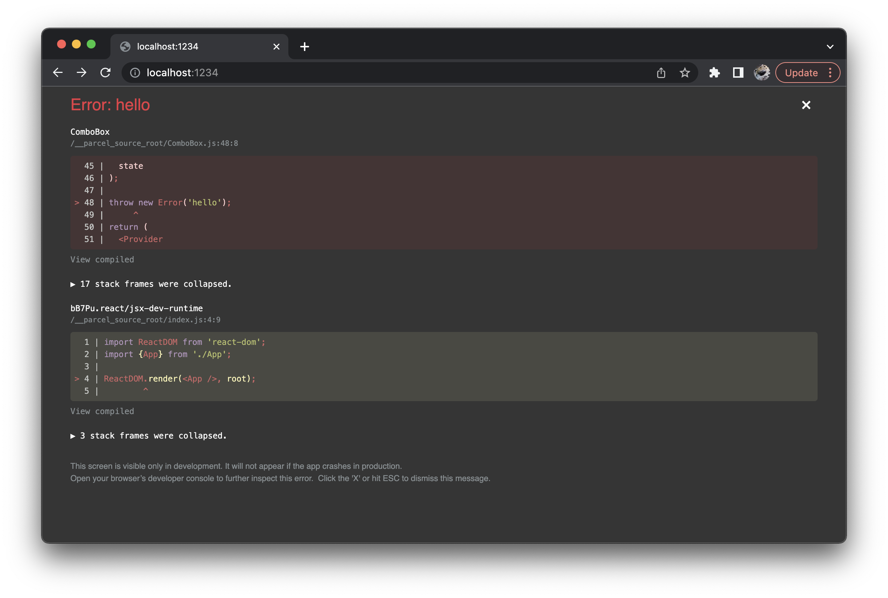

We're happy to announce Parcel v2.6.0! This release includes new features including an error overlay for React, support for source maps in HMR, and locally scoped variables in CSS modules, along with lots of bug fixes and improvements.

## React error overlay

Parcel has included an in-browser overlay for build errors for a long time, but when a runtime error occurred, it was only logged to the console. As popularized by Create React App, Parcel now also includes a runtime error overlay for React, which shows beautiful stack traces with highlighted code frames that automatically omit React framework internals.



These code frames use source maps to show you your original code, but you can also toggle to show the compiled output if you like, or expand the collapsed framework internal stack frames as well. This is all provided by the same package that Create React App uses. Thanks to the CRA team for building such a great UI for errors!

## Launch your editor right from an error

Both the React runtime error overlay and Parcel's build error overlay now support clicking on file names or line numbers in code frames to jump straight to that line in your code editor! Parcel automatically detects which editor you're using from a list of over 15 [supported editors](https://github.com/yyx990803/launch-editor#supported-editors), based on what processes are already running or installed. This makes it super easy to jump between debugging in browser to the corresponding code in your editor.

## HMR source maps

Parcel has supported both HMR and source maps for a long time, but due to the way HMR was implemented, they didn't work together. Now, they do! This means after making changes to your code and without reloading the browser, error stack traces and console logs now show the correct line and column of your source code rather than the compiled output. This makes debugging a lot easier!

For background, Parcel implements HMR updates using a web socket, which receives the compiled code for any files that you update. This code was previously evaluated using `new Function()`, which allowed us a very fast way to update modules in place without reloading an entire script tag. Unfortunately, browsers do not have good support for source maps in this API. Now we use `eval` instead by default, which has support for source maps in Chrome and Firefox. However, Safari still does not support source maps in `eval`, so we now have a fallback of loading a `<script>` tag over HTTP from the dev server to work around this. As a side benefit, if you have a content security policy that rejects eval in development, we will also automatically fall back to loading over HTTP. This should work seamlessly, it's just a little bit slower than the eval path.

## Locally scoped variables in CSS modules

CSS modules allow you to locally scope identifiers like class names, id selectors, `@keyframes` and more within a CSS file, so that they do not conflict with identifiers in other files. However, until now, this did not include CSS variables and other dashed identifiers (e.g. `--foo`). This meant that even when using CSS modules, variable names defined in one file could clash with variables in another.

Parcel now offers an opt-in way to locally scope CSS variables and other dashed identifiers (e.g. `@font-palette-values`). When enabled, Parcel will rename CSS variables to include a hash of the filename they are in so that they don't conflict with other files. If you do need to reference a variable defined in another file, there is a new CSS syntax extension to do so:

```css
.button {
  background: var(--accent-color from "./vars.module.css");
}
```

Declaring dependencies between files explicitly also enables another cool feature: **Parcel can now tree shake unused CSS variables**! Just like with JavaScript tree shaking, Parcel tracks which CSS classes, ids, `@keyframes`, and now variables are used within each file, and automatically removes unused declarations. This is only possible with CSS modules because symbols are declared and referenced locally rather than globally. This can be a really useful feature for design systems and other libraries that have a lot of CSS variables, when perhaps only some of the available components are actually used in an application.

Check out the [updated documentation](/languages/css/#local-css-variables) to learn more about this feature.

## Custom CSS modules naming patterns

Parcel now also supports a way to configure the naming pattern used when compiling CSS modules. By default, Parcel prefixes each class name with a hash of the filename it is defined within. Now, you can define custom naming patterns by configuring `@parcel/transformer-css` in your package.json.

```json
{
  "@parcel/transformer-css": {
    "cssModules": {
      "pattern": "my-company-[name]-[hash]-[local]"
    }
  }
}
```

Check out [the docs](/languages/css/#custom-naming-patterns) to learn more.

## Globs in npm packages

The `@parcel/resolver-glob` plugin allows you to import multiple files at once using glob specifiers. Previously, it only supported local files within your project, but now you can import globs from npm packages as well.

```js
import * as locales from '@company/pkg/i18n/*.js';

console.log(locales.en.message);
```

See the [documentation](/features/dependency-resolution/#glob-specifiers) for more details.

## And more!

Parcel v2.6.0 includes a bunch of other smaller features, bug fixes, and improvements including support for `compilerOptions` and `<script setup>` for Vue, support for more image formats, updates to SWC, improved Elm error messages, and more. Check out the full [release notes](https://github.com/parcel-bundler/parcel/releases/tag/v2.6.0) for more details.

- [GitHub](https://github.com/parcel-bundler/parcel)
- [Discord community](https://discord.gg/XSCzqGRuvr)
- [Support us on Open Collective](https://opencollective.com/parcel)

