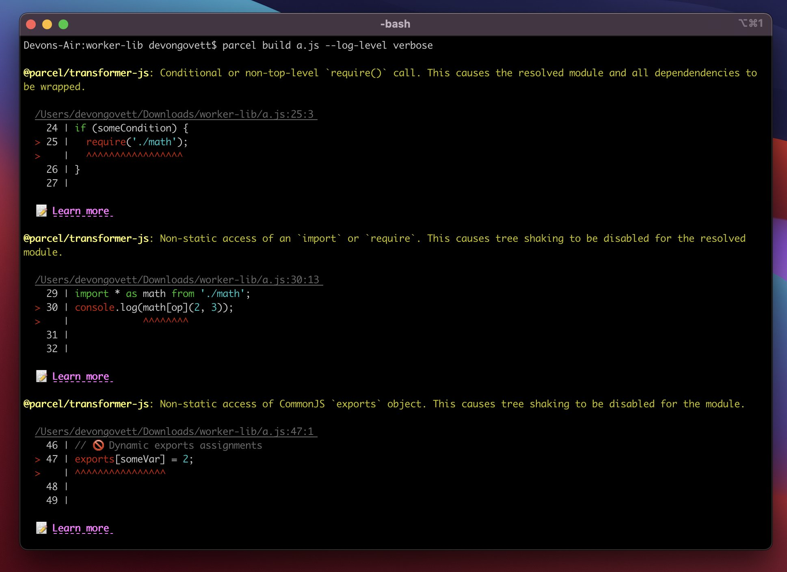
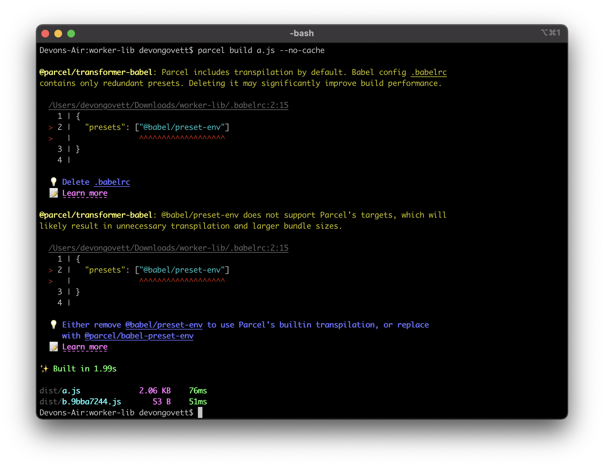

The Parcel team is beyond excited to announce that v2.0.0 stable is now available! 🎉

**Parcel 2 brings the zero configuration experience you know and love from Parcel 1, and makes it scalable and extensible to projects of any size and complexity.** It is already being used in production at some of the biggest companies in the industry including Atlassian, Adobe, and Microsoft.

Check out our [new website](/) and documentation, and the repo on [GitHub](https://github.com/parcel-bundler/parcel)!

## What's new in Parcel 2?

Parcel 2 is a ground up rewrite of Parcel that has touched every aspect. If you haven’t followed along with our pre-release blog posts, here are a few highlights.

- 🔌 **An all new plugin system**, which makes Parcel fully extensible. This allows Parcel to scale from small side projects to massive production applications with complex build requirements.
- 🌳 **Tree shaking is enabled by default**, including support for ES modules, CommonJS, dynamic imports, and CSS modules.
- 🚀 **Massive performance improvements**, including a new JavaScript compiler written in Rust, and a more parallelized architecture that takes advantage of all of your CPU cores.
- 🖖 **Automatic differential bundling via native ES modules**, which enables you to ship much smaller bundles with modern JavaScript syntax for a majority of users, with automatic fallback for older browsers if needed.
- ✂️ **Automatic code splitting**, including deduplicating common modules into shared bundles that can be loaded and cached in parallel.
- 🖼 **Image resizing, conversion, and optimization**, including support for modern image formats like AVIF and WebP, and automatic lossless optimization for JPEGs and PNGs.
- 💵 **Dramatically improved cache reliability**, including portability across machines, and automatic tracking of all configs, plugins, dev dependencies, and more – no configuration needed!
- 🔥 **Improved hot reloading**, including support for React Fast Refresh.
- 🪆 **Support for bundle inlining**, which allows you to embed the compiled contents of a bundle inside another, for example inlining an image as a data URL.
- 📚 **Support for building libraries**, including output to ES modules, CommonJS, and even bundling TypeScript definitions.
- 🧘 **Lazy development mode**, which enables Parcel to build only the files that are requested by the browser, leading to improved dev server cold startup times.
- 👷 **Improved web worker support**, including support for native ES module workers, worklets, service worker manifests, and more.
- 🚨 **Better diagnostics**, with beautiful syntax highlighted code frames, hints, and even documentation links to learn more.
- 👀 **A more reliable file watcher**, written in C++ and integrated with low level operating system APIs for fast granular cache invalidations even across Parcel restarts.
- 🗺 **Faster and more accurate source maps** using Parcel's new source maps library, which is written in Rust for a 20x performance boost over Parcel 1.
- … and a ton more!

Check out the [migration guide](/getting-started/migration/) to learn how to upgrade an existing project from Parcel 1 to Parcel 2. For many projects, it's as simple as updating the dependency in your package.json!

If you’re starting a new project, we have getting started guides for [web apps](/getting-started/webapp/) and [libraries](/getting-started/library/), and full [documentation](/docs/) on all of Parcel’s features, including all of the languages and frameworks Parcel supports.

Finally, check out our [fancy new home page](/) to get an overview of all of the features in Parcel 2! 🥳

## Why Parcel?

These days, there are a lot of build tools available to choose from, so what makes Parcel 2 different?

**Parcel’s philosophy is to enable web development best practices out of the box with zero configuration, but allow you to override and extend every aspect to fit your needs.** Best practices like automatic code splitting optimized for HTTP2, content hashed file names for long term caching, differential bundling, tree shaking, image optimization, and more are all supported out of the box completely automatically. But if you need to tweak any of these to match your specific requirements, you have full control.

**Parcel is designed for the web, not just JavaScript.** Most Parcel projects start with an HTML file, and follow all of the dependencies in your whole application from there, just like a web browser. This includes JavaScript, CSS, SVG, images, fonts, videos, WebGL shaders, RSS feeds, and much more. Native web APIs like web workers, service workers, and URL references just work out of the box.

**Parcel can build multiple targets at once**, for example a library with an ES module, CommonJS, and TypeScript definitions, a modern and legacy build of an application, or a server and a client. All of these are built in parallel, and live update as you make changes.

**Parcel’s architecture is completely language agnostic**, not a JavaScript bundler with bolted on support for other file types. The plugin system has been designed to model every aspect of modern web development, from multi-step file transformation pipelines to bundling, optimizing, and compressing output files. Each plugin type has a specific, well defined API designed for its purpose with full documentation and TypeScript definitions. The plugin system is designed for performance, with automatic parallelization and caching.

## Who's using Parcel 2?

Though we’re only just releasing the stable version of Parcel 2 today, it has been available in pre-release for a while and many teams are already using it in production.

At **Adobe**, many products have been using Parcel since v1, and several of them are already using v2 in production. This includes the main [Experience Cloud](https://business.adobe.com) app, the [React Spectrum](https://github.com/adobe/react-spectrum) component library, [Adobe Launch](https://business.adobe.com/products/experience-platform/launch.html), [Adobe I/O App Builder](https://adobe.io/app-builder), and many more. Using Parcel 2 has resulted in reduced bundle sizes leading to improved loading performance, thanks to the new automatic code splitting and improved tree shaking.

**Atlassian** has been integral to the development of Parcel 2 from the beginning, and has invested a tremendous amount into the project. They helped design the initial architecture for v2, and currently fund a team of developers to contribute to it. This includes many contributions across Parcel, including the core bundling algorithm, caching architecture, and much more. [Bitbucket](https://bitbucket.org/) is already using Parcel 2 in production, which improved their time-to-interactive metric by ~10% over their previous webpack-based build setup. In addition, Parcel's cache has improved development iteration speed, reducing the amount of time developers spend waiting for builds.

**Microsoft** is using Parcel 2 to build parts of the [docs.microsoft.com](https://docs.microsoft.com) website.

… and [many more](https://twitter.com/devongovett/status/1435638978665799683) as well!

## What's new since the RC release?

Since our [last release](/blog/rc0/), we’ve mainly focused on bug fixes and documentation, but there have been a number of new features added as well.

### First-class SVG support

Parcel now has full SVG support, including support for external dependencies referenced by tags such as `<image>` and `<use>`, as well as scripts and styles. It processes all of these references through the relevant pipeline (e.g. optimizing images and minifying CSS), and the URL is rewritten to match the output filename (e.g. including a content hash).

Parcel also processes inline `<script>` and `<style>` elements, as well as the `style` attribute, and presentation attributes like `fill`.

SVGs can be referenced as an external file from HTML, CSS, JavaScript, or anywhere else, and Parcel also handles SVGs embedded inside HTML. In JavaScript, Parcel also supports a plugin to convert SVGs to JSX for use in frameworks like React.

Finally, Parcel also includes an optimizer based on [SVGO](https://github.com/svg/svgo) to minify SVGs and reduce their sizes.

Thanks to [Chris Wilkinson](https://github.com/thewilkybarkid) for helping to implement this!

### Image optimizer

Parcel now has lossless image optimization for JPEGs and PNGs enabled by default in production mode. This reduces the size of images without affecting their quality in any way. Depending on the input images, it can make a surprising amount of difference. For example, one PNG on our new website was optimized from **~700 KB to ~430 KB with zero quality loss**. Now you’ll always get optimized images, even if you didn’t realize they needed it!

If you want to take it to the next level, check out our docs on the Parcel [image transformer](/recipes/image/), which makes it simple to resize and convert images to modern formats like WebP and AVIF.

### Service worker runtime

Parcel has supported service workers since very early on. Just use the `navigator.serviceWorker.register` API, and Parcel automatically processes the dependency. However, until now, there hasn't been a built-in way of accessing the list of files that Parcel generates from within your service worker, which you might need to implement pre-caching.

In this release, Parcel now has a new `@parcel/service-worker` package, which you can import to gain access to a manifest of URLs, and a version hash. This makes it simple to pre-cache all of your files when the service worker is installed.

```javascript
import {manifest, version} from '@parcel/service-worker';

async function install() {
  const cache = await caches.open(version);
  await cache.addAll(manifest);
}

addEventListener('install', e => e.waitUntil(install()));
```

Check out the [Service workers](/languages/javascript/#service-workers) section in the JavaScript docs for more details!

### Gzip and Brotli compression

Gzip and Brotli compression is often done automatically by servers and CDNs, but sometimes you need to upload pre-compressed bundles ahead of time. This may also allow for better compression, which would be too slow to do on every network request.

Because not everyone needs it, compression is opt-in. Just add `@parcel/compressor-gzip` and/or `@parcel/compressor-brotli` to your `.parcelrc`. Then, you'll get `.gz` and `.br` files along with your original bundles. See [the docs](/features/production/#compression) for more details on how to set this up.

Compression is not limited to Gzip and Brotli, however. In fact, it's a whole [new plugin type](/plugin-system/compressor/) in Parcel's plugin system, which runs at the very end of the build process while writing the final files. You can write your own `Compressor` plugins to compress or encode output bundles however you like. Compressors are different from `Optimizer` plugins because they do not affect the final content hash, and you can have multiple compressors to produce multiple versions of the same bundle simultaneously.

### Scope hoisting diagnostics

Have you ever wondered why tree shaking isn't working as you expect? Did something in your code (or a library) change and suddenly your bundle sizes are larger? Now Parcel can tell you when it bails out, and exactly what caused it. Just run Parcel with the `--log-level verbose` CLI option to debug, and you'll see detailed information in your terminal. Each bailout links to a corresponding section in [the documentation](/features/scope-hoisting/#avoiding-bail-outs) with more info.



### Babel preset warnings

If you’re upgrading an existing project that is using Babel, you may see warnings like this:



By default, Parcel uses [SWC](https://swc.rs) to transpile JavaScript, which is much faster than Babel. But if you have an existing project using Babel, Parcel will still pick up your Babel config. This could be slowing down your build unnecessarily.

If you're only using `@babel/preset-env`, `@babel/preset-react`, and/or `@babel/preset-typescript`, then deleting your Babel config entirely, or disabling it from being used by Parcel can significantly improve your build performance. And even if you do have other plugins, removing the default presets and letting Parcel handle transpilation automatically can still make your build faster.

Check out [the documentation](/languages/javascript/#default-presets) for more details.

### XML transformer

While building the new Parcel website, we wanted to enable this blog to be consumed via [RSS](/feed.xml). However, since the website is processed by Parcel, all of the images and other static assets include content hashes in their URLs. This meant that references in the post content within the RSS feed needed to be processed as well so they included the correct content hash.

Parcel now has an XML transformer plugin, `@parcel/transformer-xml`, which can be used to process RSS and Atom feeds. It handles all URL references in the feed, and even processes embedded HTML content through the full Parcel HTML pipeline just like any standalone HTML page! This is a great example of the power of Parcel's fully language agnostic plugin system.

Check out [the documentation](/languages/xml/) to learn more.

## New `npm:` scheme

When resolving dependencies that are specified as URLs, e.g. in HTML, CSS, or `new URL()` in JavaScript, "bare specifiers” (i.e. not starting with `./` or `/`) are treated as relative paths. This is in contrast with dependencies in JavaScript `import` statements, which treat these specifiers as node_modules packages.

But sometimes you want to reference a file in node_modules from one of these places. Now you can. Prefix the URL with the `npm:` scheme, and it will be resolved just like a JavaScript `import` statement rather than as a relative URL. This works in `<script>` elements, CSS `url()` dependencies, and everywhere else URLs are supported.

The following example shows how you could reference an npm package directly from a script tag:

```html
<script src="npm:focus-visible"></script>
```

See [the documentation](/features/dependency-resolution/#url-schemes) for more info about the URL schemes supported by Parcel.

## Thanks

Parcel 2 has been a long process, and would not have happened without the work of the amazing core team, and all of the [contributors](https://github.com/parcel-bundler/parcel/graphs/contributors) who have been involved over the years. And thanks to everyone who has sponsored or donated on [Open Collective](https://opencollective.com/parcel) for helping us recognize their hard work.

Current:

- [Will Binns-Smith](https://twitter.com/wbinnssmith)
- [Jasper De Moor](https://twitter.com/JasperDeMoor)
- [Brian Do](https://github.com/thebriando)
- [Eric Eldredge](https://twitter.com/lettertwo)
- [Agnieszka Gawrys](https://github.com/AGawrys)
- [Devon Govett](https://twitter.com/devongovett)
- [Gora Kong](https://twitter.com/gorakong)
- [Niklas Mischkulnig](https://twitter.com/mischnic)

Alumni:

- [Jamie Kyle](http://twitter.com/buildsghost)
- [Joey Slater](https://twitter.com/TheJoeySlater)
- [Maia Teegarden](https://twitter.com/padmaia)
- [Kyle Welch](https://twitter.com/kylewelch)

## Try it out!

Though we’ve been working on it for a long time, Parcel 2 is really just getting started. We’re excited to see how you use it, and have many more features and improvements coming soon. Stay tuned!

- [GitHub](https://github.com/parcel-bundler/parcel)
- [Discord community](https://discord.gg/XSCzqGRuvr)
- [Support us on Open Collective](https://opencollective.com/parcel)
